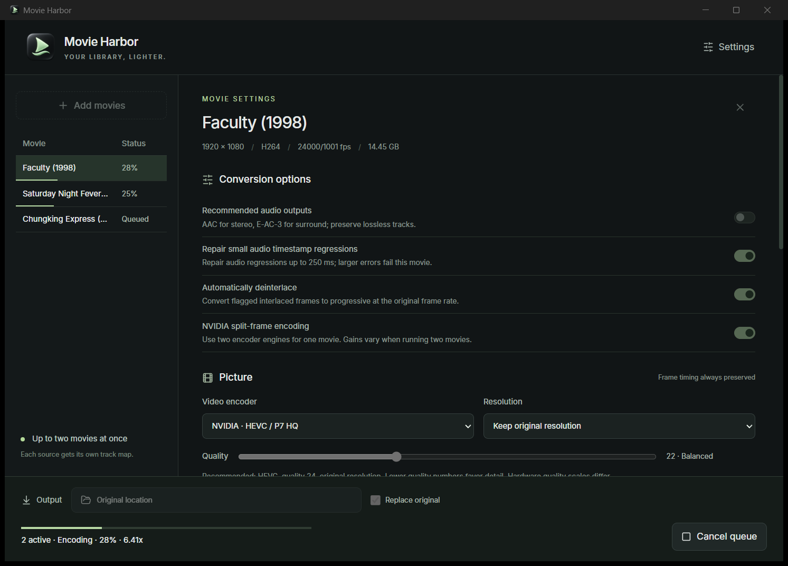

<p align="center"></p>
<h1 align="center">Movie Harbor</h1>
<p align="center"><strong>Your library, lighter.</strong><br>A focused desktop app for hardware-accelerated movie conversion on Windows and Apple Silicon.</p>
<p align="center"><a href="https://github.com/enxmp/movie-harbor/releases/tag/v0.1.0">Download</a> · <a href="#features">Features</a> · <a href="docs/REMOTE.md">Remote conversion</a> · <a href="SECURITY.md">Security</a></p>

Movie Harbor helps you reduce the size of a movie library while choosing exactly which audio and subtitle tracks to keep. Inspect each file, choose passthrough or efficient audio codecs, keep the original resolution or fit within 1080p, and let the queue work through the selections.



*A real Windows conversion session: two active jobs, individual progress underlines, and a queued third movie. The screenshot captures the original conversion interface; the public release adds configurable remote-control settings.*

## Download and install

| Platform | Download | Requirements |
| --- | --- | --- |
| Windows x64 | [MovieHarbor-Windows-x64.exe](https://github.com/enxmp/movie-harbor/releases/download/v0.1.0/MovieHarbor-Windows-x64.exe) | Windows 10/11, WebView2, FFmpeg/ffprobe; a compatible NVIDIA GPU for HEVC encoding |
| macOS Apple Silicon | [MovieHarbor-macOS-arm64.dmg](https://github.com/enxmp/movie-harbor/releases/download/v0.1.0/MovieHarbor-macOS-arm64.dmg) | macOS 12+, Apple Silicon, FFmpeg/ffprobe with VideoToolbox |

The initial release has no Developer ID signature or Apple notarization. Windows SmartScreen or macOS Gatekeeper may ask you to confirm opening it. Verify the download against the release's `SHA256SUMS.txt`. On macOS, drag Movie Harbor to Applications and use **Privacy & Security → Open Anyway** if blocked. If macOS still reports that the app is damaged, verify the checksum first, then remove quarantine from only this app with `xattr -dr com.apple.quarantine "/Applications/Movie Harbor.app"`. Do not disable platform protections globally.

Install [FFmpeg and ffprobe](https://ffmpeg.org/download.html) separately. On macOS, `brew install ffmpeg` is an option. On Windows, use a trusted FFmpeg build with NVENC support. The app looks beside its executable, on PATH, and in common Homebrew locations; you can choose explicit paths in Settings. FFmpeg binaries are not included in the downloads.

**Replacement defaults:** Replace original is enabled and Keep original backups is disabled. For a first run, turn Replace original off to save a separate result, or turn backups on in Settings. Successful replacement with backups disabled removes the original after validation; that cannot be undone from the app.

## Features

- **Hardware HEVC:** NVIDIA NVENC on Windows and Apple VideoToolbox on Apple Silicon, with 10-bit HEVC output. Video passthrough is available for remuxing or audio-only changes.
- **Independent inspection:** every movie gets its own stream map, codec information, audio choices, subtitles, and settings.
- **Track-by-track audio:** keep, remove, copy unchanged, encode AAC, or encode E-AC-3. Original track names and language tags are retained.
- **Recommended audio outputs:** selects AAC for ordinary stereo and E-AC-3 for supported surround, while keeping already-efficient, lossless, recognized object-audio, and unsupported layouts on passthrough. Manual choices remain available.
- **Original timing and resolution:** frame timing is passed through. Keep native raster or downscale to fit within 1920 × 1080, preserving aspect ratio and even dimensions without upscaling.
- **Subtitles and metadata:** selected subtitles, chapters, and subtitle-font attachments are kept; cover art is removed.
- **Automatic deinterlacing:** flagged interlaced sources can be converted to progressive at the source frame rate.
- **Small audio timestamp repair:** optionally repairs backward or duplicate audio timestamps by up to 250 ms per packet. Larger errors still fail the affected item.
- **One or two simultaneous jobs:** two jobs are the default for recognized dual-NVENC desktop cards. A failed item stays failed while later queued items continue.
- **NVIDIA split-frame mode:** supported cards can use two encoder engines for one HEVC job. It can be combined with two-job concurrency; speed gains depend on resolution, GPU memory, and workload.
- **A compact queue:** drag files into the window or sidebar, see individual progress underlines, and right-click completed items to reveal their output in the file manager.
- **Flexible output:** choose a folder, save alongside the input, or replace the original after checks. A global toggle controls original-backup retention.
- **Cleanup and recovery:** successful jobs remove their own temporary output and log. Failed or cancelled jobs keep their partial output and diagnostic log for review.
- **Authenticated remote conversion:** control a Mac from Windows through your own SSH connection and session access token. Browse a shared media folder from Windows while the Mac encodes. Hosting is off by default. [Setup guide](docs/REMOTE.md).
- **Local processing:** no accounts, telemetry, cloud uploads, ads, or automatic downloads. Remote processing is explicitly configured by the user.

## Why Movie Harbor?

The goal is a small, understandable workflow for making a movie library lighter: inspect tracks, keep the ones you want, use hardware HEVC, and manage the finished file.

| Workflow | Best fit |
| --- | --- |
| **Movie Harbor** | A desktop queue centered on per-track choices, hardware HEVC, NAS folders, and optional validated replacement |
| **A broad converter such as HandBrake** | A wider preset and filter workflow for many encoding targets; see its [official documentation](https://handbrake.fr/docs/en/latest/) |
| **FFmpeg directly** | Detailed command-line control, scripting, and formats or filters beyond this interface |
| **A library automation system** | Persistent, unattended rules applied across an entire collection |

Movie Harbor uses FFmpeg's encoders. Output quality and speed depend on the source, settings, encoder, and hardware; the app does not promise better compression than another tool using the same settings.

## Recommended workflow

1. Add files or drag them into the window. Each source is inspected individually.
2. Review the audio and subtitles. Keep lossless, Atmos, or DTS:X tracks on passthrough when preserving those formats matters.
3. Use hardware HEVC for SDR sources; choose video passthrough for HDR or Dolby Vision. Keep native resolution unless you want 1080p output.
4. Choose the destination and whether originals should be replaced or backed up.
5. Convert the queue. Check a representative result before processing a large library.

The default NVIDIA setting is P7/HQ, CQ 24. Apple uses hardware-only VideoToolbox with its own quality scale; the numbers are not equivalent between encoders. [Encoding details and limitations](docs/ENCODING.md).

## Current limits

- MKV output only. HDR/Dolby Vision transcoding is intentionally rejected; use video passthrough to preserve it.
- Windows hardware encoding currently targets NVIDIA; macOS hardware encoding targets Apple Silicon. AMD/Intel hardware encoding and CPU video encoding are not exposed.
- The queue is session-only. There is no resume after quitting, crash recovery scheduler, or background library watcher.
- Verification checks metadata and short decode samples, not every frame of an entire movie. It cannot guarantee perceptual quality or detect every source defect.
- AAC conversion supports up to eight channels; E-AC-3 conversion supports compatible layouts up to 5.1. No automatic downmixing is performed.
- Interlacing decisions rely on source flags; inverse telecine is not implemented.
- Remote control needs SSH key authentication, a trusted host entry, and an existing shared folder mounted on both computers. It does not upload movies or set up NAS mounts.
- Initial downloads are Windows x64 and macOS arm64. Linux and Intel Mac builds are not tested or distributed.

## Build from source

Install Node.js 22+, Rust stable, the [Tauri prerequisites](https://v2.tauri.app/start/prerequisites/), and FFmpeg/ffprobe.

```sh
npm ci
npm run build
cd src-tauri
cargo test --locked
cargo build --release --locked --features custom-protocol
```

The executable is under `src-tauri/target/release/`. On macOS, build with `npm run tauri -- build --bundles app,dmg`, then run `bash scripts/package-macos.sh "src-tauri/target/release/bundle/macos/Movie Harbor.app" "release/MovieHarbor-macOS-arm64.dmg"` to seal the app bundle and verify the DMG. The release workflow builds on native Windows and macOS runners.

Integration tests are marked ignored because they launch FFmpeg or require encoder hardware. For example:

```sh
cd src-tauri
cargo test failed_movie_does_not_stop_next_job -- --ignored
cargo test actual_eac3_conversion -- --ignored
```

## License and reporting

Movie Harbor is [MIT licensed](LICENSE). Dependencies keep their own licenses; see [third-party notices](THIRD_PARTY_NOTICES.md). FFmpeg is an external dependency with its own [licensing terms](https://ffmpeg.org/legal.html).

Report bugs through [GitHub Issues](https://github.com/enxmp/movie-harbor/issues). Remove private paths, access tokens, and media you do not have permission to share from reports. For security issues, follow [SECURITY.md](SECURITY.md).
